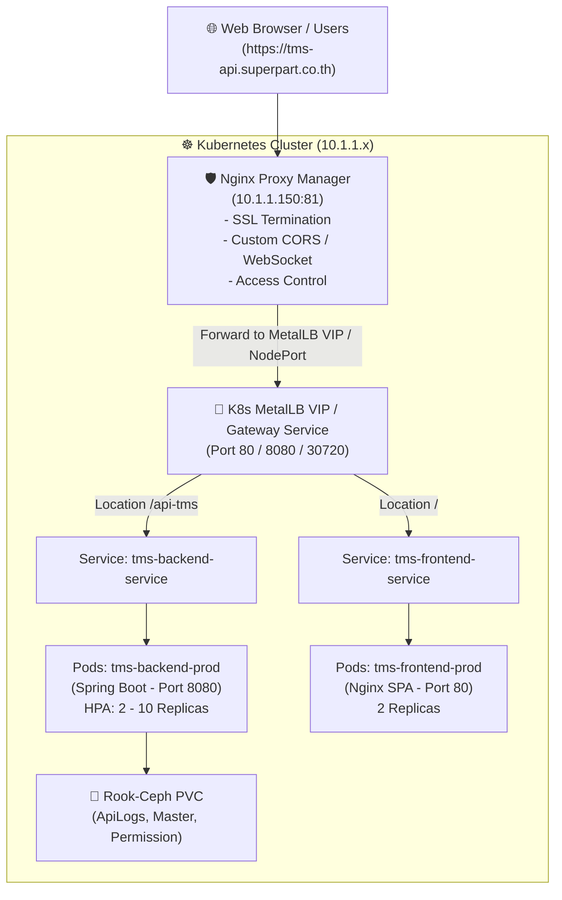

# 🚀 Implementation Plan: Full-Stack TMS Deployment (Nginx Proxy Manager + Kubernetes)

สถาปัตยกรรมฉบับรวมกับ **Nginx Proxy Manager (NPM)** ที่ `10.1.1.150` เพื่อทำหน้าที่เป็น Edge Reverse Proxy & SSL Termination ภายนอก โดยยิง Traffic ต่อไปยัง **Kubernetes Cluster** ภายใน

---

## 🎯 คำตอบเรื่อง Nginx Proxy Manager (`10.1.1.150`)

> **"แนะนำให้คงไว้ใช้งานตามเดิมก่อนเลยครับ! เป็นแนวทางที่ดีที่สุดในระยะแรกครับ"** 👍

### 💡 ทำไมการใช้ Nginx Proxy Manager คู่กับ Kubernetes ถึงดีมาก?
1. **Zero Disruption (ไม่กระทบระบบเดิม):** คุณไม่ต้องย้ายระบบ SSL Certificate (Let's Encrypt), DNS Records หรือ Access List ใน NPM ออกเลย
2. **การย้าย Traffic ทำได้ทันทีใน 1 วินาที:** ใน Nginx Proxy Manager จากเดิมที่ Forward ไปยัง `10.1.1.5:7020` (เครื่องเก่า) แค่เปลี่ยน **Forward IP** ไปยัง **Kubernetes Entrypoint (MetalLB IP หรือ NodePort)**
3. **Rollback ปลอดภัยที่สุด:** หากทดสอบระบบบน K8s แล้วพบปัญหา สามารถเปลี่ยน Forward IP ใน NPM กลับมาเป็น `10.1.1.5` เพื่อสลับไปใช้ระบบเดิมได้ทันทีในไม่กี่วินาที

---

## 🏗️ สถาปัตยกรรมการรับส่ง Traffic (NPM + K8s)

---

## ⚙️ การตั้งค่าใน Nginx Proxy Manager (`10.1.1.150`)

เมื่อย้ายระบบขึ้น Kubernetes เรียบร้อยแล้ว ในหน้าจอ Nginx Proxy Manager ของคุณ (`Edit Proxy Host` -> `Custom Locations`):

| Location | Scheme | Forward Host / IP | Forward Port | คำอธิบาย |
| :--- | :--- | :--- | :--- | :--- |
| **/api-tms** | `http` | `<K8S_VIP_OR_NODE_IP>` | `8080` (หรือ NodePort `30720`) | ส่งไปหา K8s Service ของ Backend |
| **/ms-tms** | `http` | `<K8S_VIP_OR_NODE_IP>` | `8081` (หรือ NodePort `30721`) | ส่งไปหา Microservice TMS |
| **/api-tms/v1/ws/** | `http` | `<K8S_VIP_OR_NODE_IP>` | `8080` (หรือ NodePort `30720`) | WebSocket ส่งหา Backend |
| **/** | `http` | `<K8S_VIP_OR_NODE_IP>` | `80` (หรือ NodePort `30080`) | ส่งไปหา K8s Service ของ Frontend |

---

## 🛠️ สรุปขั้นตอนการย้ายระบบ (Migration Steps)

1. **Deploy Workloads บน Kubernetes:**
   - Deploy `tms-backend-prod` (Deployment + PVC + HPA + Service)
   - Deploy `tms-frontend-prod` (Deployment + Service)
2. **ทดสอบระบบภายใน K8s:**
   - ทดสอบยิง API และเข้าเว็บผ่าน IP ของ NodePort / MetalLB VIP ภายในเครือข่าย
3. **สลับ Traffic บน Nginx Proxy Manager:**
   - เข้าหน้า `10.1.1.150:81` ➔ แก้ไข `Forward Host / IP` จาก `10.1.1.5` เป็น `<K8S_ENTRYPOINT_IP>`
   - กด **Save**
4. **เสร็จสิ้นการย้ายระบบ!** 🎉
