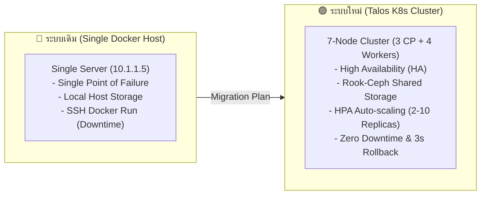

# 📊 รายงานเปรียบเทียบการย้ายระบบ (Migration Presentation)
## จาก Single-Server Docker Host ➔ 7-Node Talos Kubernetes Cluster

เอกสารฉบับนี้จัดทำขึ้นเพื่อเปรียบเทียบเชิงยุทธศาสตร์และเทคนิคสำหรับการเสนอผู้บริหารและทีมงาน DevSecOps ในการย้ายระบบจาก **Docker บน Server เครื่องเดียว** ไปสู่ **Kubernetes Cluster (Talos Linux)** ในทุกมิติ

---

## 📌 สรุปสาระสำคัญ (Executive Summary)

---

## 🔍 การเปรียบเทียบรายละเอียดรายมิติ (8 Dimensions)

### 1. 🛡️ ความทนทานและการซ่อมแซมตัวเอง (High Availability & Self-Healing)
* **Single-Server Docker Host:** 
  * หากฮาร์ดแวร์, Kernel, หรือเน็ตของเครื่อง `10.1.1.5` มีปัญหา แอปพลิเคชันทั้งหมดดับทันที (Single Point of Failure)
  * ระยะเวลาแก้ไขเท่ากับเวลาตามช่างเปลี่ยนอุปกรณ์หรือรีบูตเครื่อง (15 นาที - 1 ชั่วโมง)
* **Kubernetes Cluster:**
  * มี Control Plane 3 เครื่อง และ Worker 4 เครื่อง
  * เมื่อ Worker Node เครื่องใดเครื่องหนึ่งเสีย Kubelet และ Controller Runtime จะสั่งย้าย (Reschedule) Pods ไปทำงานบน Worker เครื่องอื่นทันที **อัตโนมัติภายใน < 30 วินาที** (Self-Healing)

---

### 2. 📈 การขยายระบบและการจัดการทรัพยากร (Scalability & Resource Allocation)
* **Single-Server Docker Host:**
  * ขนาดระบบจำกัดตามฮาร์ดแวร์เครื่องเดียว ขยายต่อไม่ได้หากไม่ดับเครื่องเพิ่ม RAM/CPU
  * เมื่อเกิด Peak Traffic (เช่น สิ้นเดือน) คอนเทนเนอร์จะแย่งทรัพยากรกันจนเครื่องค้าง
* **Kubernetes Cluster:**
  * มี **HorizontalPodAutoscaler (HPA)** ปรับจำนวน Pods อัตโนมัติ **Min 2 - Max 10 Replicas**
  * เมื่อ CPU > 75% หรือ Memory > 80% ระบบจะปั๊ม Pods เพิ่มทันที และเมื่อผู้ใช้ลดลงจะปรับลดลงมาเพื่อประหยัดทรัพยากร
  * กำหนด `requests` และ `limits` ชัดเจน ป้องกัน Pod ใด Pod หนึ่งดึงทรัพยากรเกินขนาด

---

### 3. 💾 ระบบจัดเก็บข้อมูล (Storage & Data Persistence)
* **Single-Server Docker Host:**
  * ใช้ Host Volume Mount (`-v /home/jenkins/tms/backend/ApiLogs:/app/ApiLogs`)
  * ข้อมูลผูกติดอยู่กับดิสก์ของเครื่องเดียว หากดิสก์พัง ข้อมูลสูญหายทั้งหมด
  * ไม่สามารถรัน Container เดียวกันหลายๆ ตู้พร้อมกันได้เพราะจะเกิด File Locking
* **Kubernetes Cluster:**
  * ใช้ **Rook-Ceph Distributed Storage (CephFS / RBD)**
  * ข้อมูลถูกทำสำเนา (Replication) กระจายดิสก์ข้ามทั้ง 4 Worker Nodes
  * รองรับ `ReadWriteMany` ให้ Pods 2-10 ตัว อ่านและเขียนไฟล์ลง `/app/ApiLogs`, `/app/Master`, และ `/app/Permission` ได้พร้อมกัน

---

### 4. 🌐 เครือข่ายและการจัดเส้นทาง Traffic (Networking & Ingress)
* **Single-Server Docker Host:**
  * ใช้การเปิดพอร์ตตรงผ่าน Host (`-p 7020:8080`)
  * พอร์ตชนกันง่ายเมื่อมีหลายบริการ และไม่มีระบบ Load Balancing ภายใน
* **Kubernetes Cluster:**
  * ใช้งาน **Nginx Proxy Manager (`10.1.1.150`)** ด้านหน้า คอยดูแล SSL (Let's Encrypt) และ Domain
  * ทำงานร่วมกับ **NGINX Gateway Fabric (`HTTPRoute`)** ใน Cluster เพื่อกระจาย Traffic ไปยัง Pods 2-10 ตัว อย่างสม่ำเสมอ
  * รองรับ WebSocket, CORS Headers และ Path-based Routing (`/api-tms` ➔ Backend, `/` ➔ Frontend)

---

### 5. 🚀 การ Deploy และการถอยกลับ (CI/CD & Rollback Strategy)
* **Single-Server Docker Host:**
  * รันสคริปต์ SSH สั่ง `docker stop` และ `docker rm` ตู้เก่าก่อนเปิดตู้ใหม่ ➔ **เกิด Downtime ในช่วงสลับเวอร์ชัน**
  * การ Rollback ต้องแก้เลข Tag ใน Jenkinsfile แล้วกดรันใหม่ทั้งหมด (ใช้เวลา 1-3 นาที)
* **Kubernetes Cluster:**
  * **Zero Downtime (Rolling Update):** สร้าง Pod เวอร์ชันใหม่ให้ขึ้นสถานะ `Ready` และผ่าน Health Check ก่อน แล้วจึงค่อยทยอยปลด Pod เวอร์ชันเก่าออก
  * **Instant Rollback (< 3 วินาที):** หากพบปัญหา สามารถรันคำสั่ง `kubectl rollout undo deployment/tms-backend-prod` เพื่อถอยกลับย้อนหลังได้ทันทีโดยไม่ต้องรัน Jenkins ใหม่

---

### 6. 🔒 ความปลอดภัยและการจัดการความลับ (Security & Secret Management)
* **Single-Server Docker Host:**
  * ไฟล์ SSL Key / Private Key ต้องวางไว้บนดิสก์เครื่อง หรือฝังไว้ใน Docker Image
  * ผู้ที่มีสิทธิ์ SSH เข้าเครื่องสามารถมองเห็นความลับและไฟล์ทั้งหมดได้
* **Kubernetes Cluster:**
  * เก็บความลับผ่าน **Kubernetes Secrets** ถอดรหัสอ่านใน RAM เท่านั้น
  * ดึง Image ผ่าน `imagePullSecrets` (`nexus-regcred`)
  * มีระบบ **RBAC (Role-Based Access Control)** จำกัดสิทธิ์ผู้พัฒนาและสคริปต์แยกจากกันอย่างเด็ดขาด

---

### 7. 👁️ การเฝ้าระวังและติดตามสถานะ (Monitoring & Observability)
* **Single-Server Docker Host:**
  * ต้อง SSH เข้าไปรัน `docker ps` หรือ `docker logs` ดูทีละตู้
  * ไม่มีระบบกราฟดูประวัติการใช้งาน CPU/RAM ย้อนหลัง
* **Kubernetes Cluster:**
  * ติดตามผ่าน **Headlamp Dashboard**, **Prometheus**, และ **Grafana**
  * มี **Metrics Server** ให้ข้อมูลทรัพยากรแบบ Real-time
  * มี **Liveness & Readiness Probes** คอยยิงเช็คสุขภาพแอปพลิเคชันทุก 10-15 วินาที หากแอปค้าง K8s จะรีสตาร์ท Pod นั้นให้อัตโนมัติ

---

### 8. 📊 ตารางสรุปเปรียบเทียบทุกมิติ (Comparison Matrix)

| มิติ (Dimension) | Single-Server Docker Host | Kubernetes Cluster (Talos) | Impact |
| :--- | :--- | :--- | :--- |
| **High Availability** | 🔴 เครื่องล่ม ระบบดับทั้งหมด (SPOF) | 🟢 7 Nodes (3 CP + 4 Workers) | **ความทนทานสูงขึ้น 99.99%** |
| **Auto-scaling** | 🔴 สเกลมือ (Manual Resize) | 🟢 HPA อัตโนมัติ (2 - 10 Replicas) | **รองรับผู้ใช้ได้มากขึ้น 500%** |
| **Data Persistence** | 🔴 Local Disk เครื่องเดียว | 🟢 Rook-Ceph Distributed Storage | **ป้องกันข้อมูลสูญหาย 100%** |
| **Deployment Downtime** | 🔴 มี Downtime ช่วงสั่ง Stop/Run | 🟢 Zero Downtime (Rolling Update) | **ผู้ใช้งานไม่รู้สึกสะดุด** |
| **Rollback Speed** | 🔴 1-3 นาที (Re-build Jenkins) | 🟢 < 3 วินาที (`kubectl rollout undo`) | **กู้นำระบบกลับได้ทันที** |
| **Health Checks** | 🔴 `restart: always` พื้นฐาน | 🟢 Liveness & Readiness Probes | **ตรวจจับแอปค้างได้ทันที** |
| **Monitoring** | 🔴 สั่งเช็คทีละตู้ผ่าน SSH | 🟢 Prometheus, Grafana, Headlamp | **เห็นภาพรวมระบบได้ 360°** |
