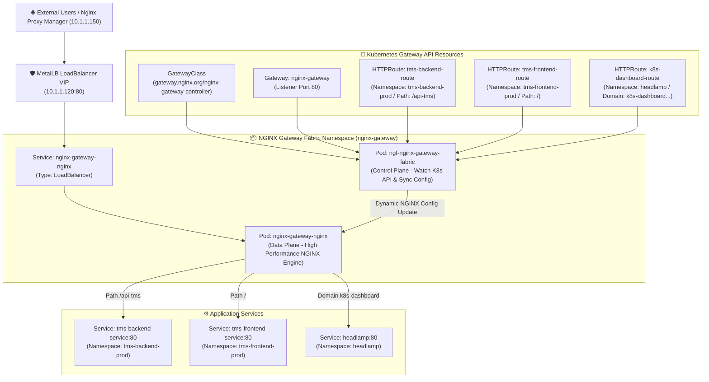

# 📘 NGINX Gateway Fabric (Kubernetes Gateway API) Deep Dive Guide

คู่มือเจาะลึกสถาปัตยกรรม การทำงาน และการบริหารจัดการ **NGINX Gateway Fabric** ใน Kubernetes Cluster

---

## 📌 1. NGINX Gateway Fabric คืออะไร?

**NGINX Gateway Fabric (NGF)** เป็น Open-Source Gateway Controller ยุคใหม่จาก **F5 / NGINX** ที่ถูกพัฒนาขึ้นตามมาตรฐาน **Kubernetes Gateway API (`gateway.networking.k8s.io`)** ซึ่งเป็นมาตรฐานระดับสูงที่เข้ามาแทนที่ Ingress Controller แบบเดิม (`networking.k8s.io/v1 Ingress`)

### ⚡ เปรียบเทียบ Ingress Controller (แบบเดิม) vs Kubernetes Gateway API (แบบใหม่)

| หัวข้อ | Ingress Controller (แบบเดิม) | NGINX Gateway Fabric (Gateway API) |
| :--- | :--- | :--- |
| **มาตรฐาน** | Monolithic Spec (`Ingress` ตัวเดียวรับจบทุกอย่าง) | Role-Oriented Spec (แยกบทบาทชัดเจน: Admin, Infra, Dev) |
| **การตั้งค่าแบบซับซ้อน** | พึ่งพา Annotations ของผู้ผลิตแต่ละเจ้า | ใช้ Standard CRDs (`HTTPRoute`, `GRPCRoute`, `TLSRoute`) |
| **Cross-Namespace** | ทำได้ยากและเสี่ยงเรื่องความปลอดภัย | ใช้ `ReferenceGrant` ควบคุมสิทธิ์ข้าม Namespace อย่างปลอดภัย |
| **การจัดแบ่งหน้าที่** | ทุกคนต้องแก่งแย่งกันแก้ไฟล์ `Ingress` เดียวกัน | Admin ดูแล `Gateway` / Dev เขียนเฉพาะ `HTTPRoute` ของตนเอง |

---

## 🏗️ 2. สถาปัตยกรรมการทำงานใน Cluster ของคุณ



---

## 🧩 3. เจาะลึก 4 ทรัพยากรหลัก (Core Custom Resource Definitions)

### 1️⃣ **GatewayClass (`gateway.networking.k8s.io/v1`)**
* **เปรียบเหมือน:** "ไดรเวอร์ / เอนจินหลัก" ของระบบ Gateway ระดับ Cluster Admin
* **หน้าที่:** กำหนด Controller ที่จะมาคุมระบบ NGINX
* **การตั้งค่า:**
  ```yaml
  apiVersion: gateway.networking.k8s.io/v1
  kind: GatewayClass
  metadata:
    name: nginx
  spec:
    controllerName: gateway.nginx.org/nginx-gateway-controller
  ```

---

### 2️⃣ **Gateway (`gateway.networking.k8s.io/v1`)**
* **เปรียบเหมือน:** "ประตูทางเข้าหลัก / Virtual Appliance" ของเครือข่าย
* **หน้าที่:** กำหนด IP (เชื่อมต่อ MetalLB), พอร์ตที่เปิดรับ (Port 80/443), Listeners และ TLS Certificates
* **ไฟล์ที่ใช้ใน Cluster ของคุณ (`namespace: nginx-gateway`):**
  ```yaml
  apiVersion: gateway.networking.k8s.io/v1
  kind: Gateway
  metadata:
    name: nginx-gateway
    namespace: nginx-gateway
  spec:
    gatewayClassName: nginx
    listeners:
      - name: http
        port: 80
        protocol: HTTP
        allowedRoutes:
          namespaces:
            from: All   # 👈 อนุญาตให้ HTTPRoute จากทุก Namespace มาต่อเกาะได้
  ```

---

### 3️⃣ **HTTPRoute (`gateway.networking.k8s.io/v1`)**
* **เปรียบเหมือน:** "ป้ายบอกทาง (Traffic Routing Rules)" ของแต่ละแอปพลิเคชัน
* **หน้าที่:** จับคู่ Hostname, URI Path (`PathPrefix`), Headers, และส่งต่อลง Service ปลายทาง
* **ข้อดี:** นักพัฒนาสามารถสร้างไฟล์ `HTTPRoute` ไว้ใน Namespace ของแอปตนเองได้โดยไม่ต้องรบกวน Namespace อื่น
* **ตัวอย่าง (`namespace: tms-backend-prod`):**
  ```yaml
  apiVersion: gateway.networking.k8s.io/v1
  kind: HTTPRoute
  metadata:
    name: tms-backend-route
    namespace: tms-backend-prod
  spec:
    parentRefs:
      - name: nginx-gateway
        namespace: nginx-gateway  # 👈 ชี้กลับไปที่ Gateway หลัก
    hostnames:
      - "tms-api.superpart.co.th"
    rules:
      - matches:
          - path:
              type: PathPrefix
              value: /api-tms
        backendRefs:
          - name: tms-backend-service
            port: 80
  ```

---

### 4️⃣ **ReferenceGrant (`gateway.networking.k8s.io/v1beta1`)**
* **เปรียบเหมือน:** "ใบอนุญาตความปลอดภัยข้าม Namespace (Cross-Namespace Security Policy)"
* **หน้าที่:** อนุญาตข้ามขอบเขตความปลอดภัย เช่น อนุญาตให้ HTTPRoute ใน Namespace `headlamp` เรียกใช้ Service ใน Namespace อื่น

---

## 🛠️ 4. คำสั่งตรวจสอบและบริหารจัดการ (Operational Cheat Sheet)

### 1. เช็คสถานะการทำงานของ NGINX Gateway Fabric ทั้งหมด:
```bash
kubectl get all -n nginx-gateway
```

### 2. เช็ครายชื่อ Gateway ทั้งหมดและ IP ที่ได้รับจาก MetalLB:
```bash
kubectl get gateway -A
```

### 3. เช็คสถานะ HTTPRoutes ทั้งหมดในทุก Namespace:
```bash
kubectl get httproute -A
```

### 4. ตรวจสอบการยึดติดของ Route (Debug HTTPRoute Status):
```bash
kubectl describe httproute <NAME> -n <NAMESPACE>
```
*(ดูในส่วน `Status.Parents.Conditions` จะต้องขึ้น `Accepted: True` และ `ResolvedRefs: True`)*

### 5. ดู NGINX Configuration ที่ถูกคำนวณและเจนออกมาใช้งานจริง:
```bash
kubectl exec -it -n nginx-gateway deployment/nginx-gateway-nginx -- cat /etc/nginx/nginx.conf
```

---

## 💎 สรุปจุดเด่นที่ทำให้ระบบของคุณเสถียรสูง

1. **Decoupled Architecture:** NGINX Control Plane แยกกับ Data Plane ทำให้ระบบไม่กระตุกขณะอัปเดตคอนฟิก
2. **Multi-Tenant Friendly:** ทีมพัฒนา Frontend (`tms-frontend-prod`), Backend (`tms-backend-prod`), Queue (`tms-queue-prod`) เขียน HTTPRoute ใน Namespace ของตนเองได้อย่างอิสระ
3. **Seamless Edge Proxy Integration:** ทำงานร่วมกับ Nginx Proxy Manager (`10.1.1.150`) ด้านนอกได้อย่างสมบูรณ์แบบ
